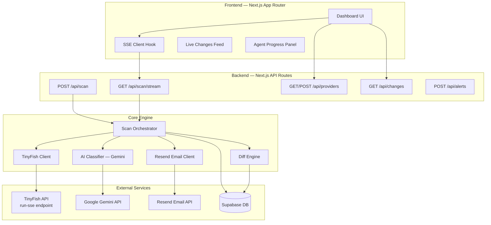

# 🐤 Canary — Autonomous API Change Monitoring Agent

**Objective:** Build a hackathon-winning MVP that uses TinyFish to scrape real API changelogs/deprecations/status pages, diffs changes against stored snapshots, classifies urgency with AI, and displays everything in a live dashboard with real-time agent progress streaming.

---

## 1. System Architecture



### Data Flow (End-to-End)

```
User clicks "Scan" (selects ≤2 providers)
    │
    ▼
POST /api/scan → creates scan record → returns scan_id
    │
    ▼
GET /api/scan/stream?scanId=xxx  (SSE connection opened)
    │
    ▼
Orchestrator loops providers SEQUENTIALLY (for visual clarity):
    │
    ├─ For Provider A:
    │   ├─ TinyFish: scrape changelog   ┐
    │   ├─ TinyFish: scrape deprecations ├─ Promise.all (parallel)
    │   └─ TinyFish: scrape status       ┘
    │   │
    │   ├─ SSE → "Stripe changelog ✓"
    │   ├─ SSE → "Stripe deprecations ✓"
    │   ├─ SSE → "Stripe status ✓"
    │   │
    │   ├─ Diff Engine: compare with stored snapshot
    │   ├─ AI Classifier: classify each new change
    │   ├─ Store new snapshot + changes in Supabase
    │   └─ SSE → "Stripe analysis complete ✓"
    │
    ├─ For Provider B: (same flow)
    │
    ▼
SSE → "Scan complete" → close stream
    │
    ▼
Dashboard renders changes feed (sorted by urgency)
    │
    ▼
If urgency ≥ 7 → Resend email alert (fire-and-forget)
```

---

## 2. Module Breakdown

### 2.1 TinyFish Client (`lib/tinyfish.ts`)

| Aspect | Detail |
|--------|--------|
| **Purpose** | Wrap TinyFish API calls for scraping web content |
| **Inputs** | `url: string`, `goal: string`, `browserProfile: 'lite' \| 'stealth'` |
| **Outputs** | Structured JSON (changelog entries, deprecation info, status data) |
| **API** | `POST https://agent.tinyfish.ai/v1/automation/run` (sync endpoint) |
| **Dependencies** | `TINYFISH_API_KEY` env var |

**Key design decisions:**
- Use the **synchronous** `/v1/automation/run` endpoint (not SSE) — simpler handling, we create our own SSE layer for the dashboard
- Use `browser_profile: "stealth"` for sites with anti-bot protection
- Craft highly specific `goal` prompts requesting JSON output with exact field names
- 60s timeout per call with graceful error handling

### 2.2 Scan Orchestrator (`lib/scan-orchestrator.ts`)

| Aspect | Detail |
|--------|--------|
| **Purpose** | Coordinates the full scan pipeline and emits SSE events |
| **Inputs** | `providerIds: string[]`, `sseWriter` (response stream writer) |
| **Outputs** | SSE events (progress + results) |
| **Dependencies** | TinyFish Client, Diff Engine, AI Classifier, Supabase |

**Key design decisions:**
- Providers processed **sequentially** (visual clarity for demo)
- Within a provider, the 3 source types (changelog, deprecation, status) scraped in **parallel** via `Promise.allSettled`
- Each TinyFish call result emits an SSE progress event immediately
- Partial failures are tolerated — one source failing doesn't block others

### 2.3 Diff Engine (`lib/diff-engine.ts`)

| Aspect | Detail |
|--------|--------|
| **Purpose** | Compare current scrape results against last stored snapshot |
| **Inputs** | `providerId`, current scraped data |
| **Outputs** | `{ newEntries, newDeprecations, statusChanges }` |
| **Dependencies** | Supabase (snapshots table) |

**Key design decisions:**
- Compare by hashing entry titles/dates as composite keys
- First scan for a provider → everything is "new"
- Store raw scraped JSON as a JSONB column for future diffing

### 2.4 AI Classifier (`lib/ai-classifier.ts`)

| Aspect | Detail |
|--------|--------|
| **Purpose** | Classify each changed item with urgency, type, and action required |
| **Inputs** | Array of raw change items (from diff) |
| **Outputs** | Classified changes with: `change_type`, `urgency (1-10)`, `summary`, `action_required`, `timeline` |
| **Dependencies** | Google Gemini API (via `@google/generative-ai`) |

**Key design decisions:**
- Batch all changes for a single provider into ONE Gemini call (reduce latency)
- Use structured JSON output mode
- System prompt is pre-tuned for developer-facing language
- Temperature = 0.2 for consistent classification

### 2.5 Email Alerter (`lib/email-alerter.ts`)

| Aspect | Detail |
|--------|--------|
| **Purpose** | Send email alerts for high-urgency changes |
| **Inputs** | Changes with urgency ≥ 7, recipient email from env |
| **Outputs** | Sent email confirmation |
| **Dependencies** | Resend SDK |

### 2.6 Provider Registry (`lib/providers.ts`)

| Aspect | Detail |
|--------|--------|
| **Purpose** | Manage the list of API providers and their URLs |
| **Inputs** | Static seed data + user-added custom providers |
| **Outputs** | Provider configs with changelog/deprecation/status URLs |

**Seed Providers (5):**

| Provider | Changelog URL | Deprecation URL | Status URL |
|----------|--------------|-----------------|------------|
| Stripe | `https://stripe.com/blog/changelog` | `https://stripe.com/docs/upgrades` | `https://status.stripe.com` |
| OpenAI | `https://platform.openai.com/docs/changelog` | `https://platform.openai.com/docs/deprecations` | `https://status.openai.com` |
| GitHub | `https://github.blog/changelog/` | `https://github.blog/changelog/` (filtered) | `https://www.githubstatus.com` |
| Twilio | `https://www.twilio.com/en-us/changelog` | `https://www.twilio.com/en-us/changelog` (filtered) | `https://status.twilio.com` |
| Vercel | `https://vercel.com/changelog` | `https://vercel.com/changelog` (filtered) | `https://www.vercel-status.com` |

---

## 3. Data Design (Supabase)

### 3.1 `providers` table

```
id              UUID        PK, default gen_random_uuid()
name            TEXT        NOT NULL
slug            TEXT        UNIQUE NOT NULL
logo_url        TEXT        nullable
changelog_url   TEXT        NOT NULL
deprecation_url TEXT        nullable
status_url      TEXT        nullable
is_custom       BOOLEAN     DEFAULT false
created_at      TIMESTAMPTZ DEFAULT now()
```

### 3.2 `scans` table

```
id              UUID        PK, default gen_random_uuid()
status          TEXT        'running' | 'completed' | 'failed'
provider_ids    TEXT[]      array of provider IDs scanned
started_at      TIMESTAMPTZ DEFAULT now()
completed_at    TIMESTAMPTZ nullable
error           TEXT        nullable
```

### 3.3 `snapshots` table

```
id              UUID        PK, default gen_random_uuid()
provider_id     UUID        FK → providers.id
scan_id         UUID        FK → scans.id
source_type     TEXT        'changelog' | 'deprecation' | 'status'
raw_data        JSONB       full scraped data
content_hash    TEXT        hash of raw_data for quick comparison
captured_at     TIMESTAMPTZ DEFAULT now()
```

### 3.4 `changes` table

```
id              UUID        PK, default gen_random_uuid()
scan_id         UUID        FK → scans.id
provider_id     UUID        FK → providers.id
source_type     TEXT        'changelog' | 'deprecation' | 'status'
title           TEXT        NOT NULL
raw_content     TEXT        original scraped text
change_type     TEXT        'breaking' | 'deprecation' | 'feature' | 'incident' | 'resolved'
urgency         INTEGER     1-10
summary         TEXT        AI-generated human-friendly summary
action_required TEXT        what developer should do
timeline        TEXT        'immediate' | 'soon' | 'later'
detected_at     TIMESTAMPTZ DEFAULT now()
```

### Snapshot Structure (JSONB)

```json
// changelog snapshot
{
  "entries": [
    { "date": "2026-03-20", "title": "...", "summary": "...", "type": "feature" }
  ]
}

// deprecation snapshot
{
  "deprecations": [
    { "endpoint": "/v1/charges", "sunset_date": "2026-06-01", "migration": "Use /v2/payments" }
  ]
}

// status snapshot
{
  "overall_status": "operational",
  "active_incidents": [],
  "recent_incidents": [
    { "title": "API degradation", "date": "2026-03-18", "status": "resolved" }
  ]
}
```

---

## 4. Agent Workflow (Detailed Pipeline)

### Step 1: Initiate Scan
- User selects ≤2 providers → clicks "Start Scan"
- `POST /api/scan` creates a `scans` record with `status: 'running'`
- Returns `scan_id`
- Frontend opens SSE: `GET /api/scan/stream?scanId={scan_id}`

### Step 2: Scrape (per provider, sequential)
For each provider, run 3 TinyFish calls in parallel:

**Changelog goal prompt:**
> "Navigate to this page. Extract the latest 3 changelog entries. For each entry return: date (ISO format), title, summary (1-2 sentences), and change_type (one of: breaking, deprecation, feature, improvement, fix). Prioritize breaking changes and deprecations. Return as JSON array with key 'entries'."

**Deprecation goal prompt:**
> "Navigate to this page. Extract all currently active deprecations or sunset notices. For each, return: endpoint_name, sunset_date (ISO format or 'unknown'), migration_path (recommended replacement). Return as JSON with key 'deprecations'."

**Status goal prompt:**
> "Navigate to this page. Extract: overall_status (operational/degraded/outage), any active_incidents (title, severity, started_at), and up to 3 recent_incidents (title, date, status). Return as JSON."

Each result fires: `SSE → { type: 'progress', provider: 'Stripe', source: 'changelog', status: 'done' }`

### Step 3: Diff
- Load previous snapshot for this provider from `snapshots` table
- Compare using content hash first (fast path: if hash matches → no changes)
- If different, do entry-level comparison:
  - New changelog entries (by title+date composite key)
  - New deprecations (by endpoint name)
  - Status changes (by overall_status flip or new incidents)
- Store new snapshot in `snapshots` table

### Step 4: AI Classification
- Batch all new changes for this provider into a single Gemini API call
- System prompt ensures consistent JSON output with fields: `change_type`, `urgency`, `summary`, `action_required`, `timeline`
- Store classified changes in `changes` table
- Fire SSE: `{ type: 'analysis_complete', provider: 'Stripe', changeCount: 3 }`

### Step 5: Alert
- For any change with `urgency ≥ 7`, queue an email via Resend
- Fire-and-forget (don't block the scan)

### Step 6: Complete
- Update `scans` record: `status: 'completed'`, `completed_at: now()`
- Fire SSE: `{ type: 'scan_complete', scanId: '...' }`
- Close SSE stream

---

## 5. MVP Scope

### ✅ Included

| Feature | Priority |
|---------|----------|
| 5 pre-configured API providers | P0 |
| TinyFish scraping (changelog + deprecation + status) | P0 |
| Live Agent Progress Panel with SSE | P0 |
| Snapshot storage + diff engine | P0 |
| AI classification (Gemini) with urgency scoring | P0 |
| Live Changes Feed (sorted by urgency, filterable) | P0 |
| Urgency color coding (red/amber/green) | P0 |
| Max 2 providers per scan enforcement | P0 |
| Add Custom Provider (paste URL + validate) | P1 |
| Email alerts via Resend (urgency ≥ 7) | P1 |
| "30+ APIs supported" marketing text | P1 |

### ❌ Excluded

| Feature | Reason |
|---------|--------|
| Authentication | Complexity — single user MVP |
| Auto-refresh / cron scanning | Time — show as "coming soon" |
| Provider history timeline | Time — optional stretch goal |
| Developer blog monitoring | Scope cut per spec |
| More than 2 providers per scan | Performance constraint |
| Webhook integrations (Slack, etc.) | Time — v2 feature |
| Dark/light mode toggle | Low demo impact |

---

## 6. Execution Plan

### Phase 1 — Foundation (6 files)

**Goal:** Project scaffolding, database, and core configuration.

1. Initialize Next.js project with App Router, TypeScript, Tailwind
2. Install dependencies: `@supabase/supabase-js`, `resend`, `@google/generative-ai`, `crypto`
3. Set up environment variables (`.env.local`)
4. Create Supabase tables (run SQL migration)
5. Create Supabase client helper (`lib/supabase.ts`)
6. Create provider seed data module (`lib/providers.ts`)
7. Seed 5 providers into the database

**Deliverable:** Running Next.js app + Supabase schema + seeded providers.

---

### Phase 2 — TinyFish Scraper (3 files)

**Goal:** Working TinyFish integration that can scrape any URL and return structured data.

1. Create TinyFish client (`lib/tinyfish.ts`)
   - Wraps `/v1/automation/run` (synchronous) endpoint
   - Configurable timeout, error handling, retry logic
   - Returns typed results
2. Create goal prompt templates for each source type (`lib/prompts.ts`)
   - Changelog extraction prompt (latest 3 entries)
   - Deprecation extraction prompt
   - Status page extraction prompt
3. Create scraper module (`lib/scraper.ts`)
   - `scrapeProvider(provider)` → runs 3 TinyFish calls in parallel
   - Returns `{ changelog, deprecations, status }` with partial failure handling

**Deliverable:** Can pass a provider and get structured JSON from all 3 source types.

---

### Phase 3 — Diff + AI Classification (3 files)

**Goal:** Detect new changes and classify them intelligently.

1. Create diff engine (`lib/diff-engine.ts`)
   - Load previous snapshot from Supabase
   - Content hash comparison (fast path)
   - Entry-level diffing for granular changes
   - Store new snapshot
2. Create AI classifier (`lib/ai-classifier.ts`)
   - Single batched Gemini call per provider
   - System prompt with strict JSON schema
   - Returns classified changes array
3. Create email alerter (`lib/email-alerter.ts`)
   - Uses Resend SDK
   - Sends for urgency ≥ 7
   - HTML email template with provider name, summary, action_required

**Deliverable:** Full pipeline from raw scrape → classified changes → stored in DB → email sent.

---

### Phase 4 — API Routes + SSE (4 files)

**Goal:** Backend API with live streaming progress.

1. `POST /api/scan` (`app/api/scan/route.ts`)
   - Validate: ≤2 providers selected
   - Create scan record in Supabase
   - Return `scanId`
2. `GET /api/scan/stream` (`app/api/scan/stream/route.ts`)
   - SSE endpoint using `ReadableStream` + `TransformStream`
   - Instantiate Scan Orchestrator with SSE writer
   - Stream progress events as text/event-stream
3. Scan Orchestrator (`lib/scan-orchestrator.ts`)
   - Loop providers sequentially
   - For each: scrape (parallel) → diff → classify → store → alert
   - Emit SSE events at each milestone
4. `GET /api/changes` (`app/api/changes/route.ts`)
   - Query changes table, filterable by provider, change_type
   - Sorted by urgency DESC, detected_at DESC
5. `GET/POST /api/providers` (`app/api/providers/route.ts`)
   - GET: list all providers
   - POST: add custom provider (validate URL via TinyFish test scrape)

**Deliverable:** Full backend with SSE streaming and REST endpoints.

---

### Phase 5 — Dashboard UI (5 files)

**Goal:** Stunning, demo-ready dashboard.

1. Layout + global styles (`app/layout.tsx`, `app/globals.css`)
   - Dark theme with glassmorphism cards
   - Inter/Outfit font from Google Fonts
   - CSS variables for urgency colors
2. Dashboard page (`app/page.tsx`)
   - Main layout: left panel (provider selector + scan button) + right panel (feed + progress)
3. Provider Selector component (`components/provider-selector.tsx`)
   - Cards for each provider with logo, name, checkbox
   - Enforces max 2 selection with visual feedback
   - "30+ APIs supported" badge
4. Agent Progress Panel (`components/agent-progress.tsx`)
   - Real-time SSE consumer using custom hook (`hooks/use-scan-stream.ts`)
   - Animated checklist with provider → source breakdowns
   - Checkmarks animate in as each source completes
   - Pulsing dot for currently running task
   - **This is the WOW feature — polish heavily**
5. Live Changes Feed (`components/changes-feed.tsx`)
   - Cards with urgency color left border (red/amber/green)
   - Provider badge, change type badge, timestamp
   - AI summary with action_required callout
   - Filter bar: by provider, by change type
6. Add Provider Modal (`components/add-provider-modal.tsx`)
   - URL input + validation feedback
   - Loading state while TinyFish validates

**Deliverable:** Complete, polished, demo-ready dashboard.

---

### Phase 6 — Polish & Demo Prep (no new files)

**Goal:** Bug fixes, micro-animations, demo rehearsal.

1. Add CSS micro-animations:
   - Scan button pulse when idle
   - Progress checkmarks slide + fade in
   - Feed cards stagger-animate on load
   - Urgency badges glow effect
2. Error states and empty states
3. "Coming Soon" section for auto-refresh/cron
4. Test full end-to-end flow with 2 providers
5. Record 2-3 min demo video

---

## 7. Risks & Simplifications

### High-Risk Areas

| Risk | Impact | Mitigation |
|------|--------|------------|
| TinyFish returns unstructured/unexpected JSON | Breaks parsing & classification | Defensive parsing with fallback. Validate against expected shape. log raw output. |
| TinyFish timeout (>60s per call) | Scan feels slow, serverless limits | Use sync endpoint with 90s timeout. Process providers sequentially to spread load. Show progress via SSE so user knows it's working. |
| Anti-bot protection on target sites | TinyFish scrape fails | Use `browser_profile: "stealth"`. Have fallback "Unable to scrape" state per source. Status pages are generally scrapeable. |
| Gemini API latency | Adds 5-10s per provider | Batch all changes into single call. Can pre-compute while next provider scrapes. |
| SSE connection drops | User sees stale progress | Add reconnection logic on frontend. Store progress in scan record for recovery. |

### Key Simplifications

1. **No incremental updates** — each scan is a full re-scrape of all 3 sources per provider
2. **No webhook/polling for TinyFish** — use synchronous calls, simpler error model
3. **Generous TinyFish goals** — ask for JSON directly, accept whatever structure comes back and normalize
4. **Single Gemini call per provider** — batch reduces latency vs per-change calls
5. **No auth** — single user, no multi-tenancy complexity
6. **Provider logos** — use simple colored initials/icons instead of actual logos (avoid broken images)

---

## 8. Demo Strategy

### The Story (2-3 minutes)

> "Every developer depends on third-party APIs. When Stripe deprecates an endpoint or OpenAI changes a model, you find out from Twitter — hours or days late. Canary is your autonomous API watchdog."

### Demo Flow

1. **Open Dashboard** (0:00-0:15)
   - Show the polished dark UI with 5 provider cards
   - Highlight "30+ APIs supported" text
   - Select Stripe + OpenAI (show max 2 enforcement)

2. **Start Scan — The WOW Moment** (0:15-1:30)
   - Click "Start Scan"
   - **Agent Progress Panel comes alive:**
     - "🔍 Scanning Stripe..."
     - "  📋 Changelog ✓" (animates in)
     - "  ⚠️ Deprecations ✓" (animates in)
     - "  🟢 Status ✓" (animates in)
     - "  🧠 Analyzing changes..." → "✅ Stripe complete"
   - Same for OpenAI
   - **This is TinyFish doing REAL work on REAL websites** — the judges see multi-step web automation live

3. **Show Results** (1:30-2:15)
   - Feed populates with urgency-sorted changes
   - Point out a RED (breaking change) card: "This deprecation has urgency 9/10 — Canary tells you exactly what to migrate to"
   - Show the AI-generated summary vs the raw changelog text
   - Filter by change type to show only deprecations

4. **Add Custom Provider** (2:15-2:30)
   - Paste a URL → TinyFish validates → provider added
   - "You can monitor ANY API with a changelog page"

5. **Email Alert** (2:30-2:45)
   - Show the Resend email triggered for the breaking change
   - "Critical changes are emailed to you automatically"

6. **Close** (2:45-3:00)
   - "Canary is your autonomous API watchdog. It watches the web so you don't have to."

### Key "WOW Moments" for Judges

1. **Live TinyFish Agent at Work** — real browser navigating real websites, extracting structured data — this is the core hackathon requirement
2. **Real-Time Progress Panel** — you SEE each source being scraped, like watching a CI/CD pipeline
3. **AI Intelligence Layer** — urgency scoring transforms raw data into actionable intelligence
4. **Multi-Source Aggregation** — changelog + deprecations + status in one view per provider
5. **Legitimate Business Value** — every company with API dependencies needs this

---

## 9. 💡 My Strategic Recommendations

> [!IMPORTANT]
> **Key insights from analyzing the hackathon rules that should influence our build:**

### What Judges Will Reject ❌
The hackathon page explicitly says they reject:
- "Simple text summarizers or chatbots sitting on top of a database"
- "Basic RAG applications that don't interact with the live web"
- "Thin wrappers that add a UI layer over an existing API"

### Why Canary Wins ✅
- **Multi-step web automation**: TinyFish navigates complex changelog pages, handles pagination, JavaScript rendering — exactly what judges want
- **Real business value**: API monitoring is a real pain point — companies like Kong, RapidAPI charge for this
- **Not a wrapper**: We're doing genuine web scraping + diffing + AI classification — three distinct intelligence layers

### Tactical Suggestions

1. **Use `browser_profile: "stealth"`** for all scrapes — some changelog pages have Cloudflare protection. Stealth mode prevents embarrassing failures during demo.

2. **Pre-warm the scan before demo**: Run a scan beforehand so there's a stored snapshot. Then during the demo, the diff engine actually shows REAL changes vs the previous scan. This makes the diff feature genuinely useful vs just "everything is new."

3. **Demo provider choice matters**: Pick Stripe + OpenAI for the demo. They have the most structured changelogs and are the most recognizable brands. Avoid GitHub (changelog is a blog, harder to parse) for the live demo.

4. **Record the demo as a screen recording** and post on X tagging @Tiny_Fish — this is a submission requirement.

5. **Add a TinyFish attribution badge** in the footer/about section. Judges love seeing their brand featured.

6. **The progress panel is 80% of demo impact**. Spend 30% of total UI time on this component alone. Add satisfying animations — fast checkmarks, subtle sound effects if possible.

7. **Add a timer** showing how long the scan took — "Scanned 2 APIs across 6 sources in 47 seconds" — this is impressive when humans would need 15+ minutes.

---

## 10. File Structure

```
canaryApi/
├── app/
│   ├── layout.tsx                    # Root layout, fonts, global providers
│   ├── page.tsx                      # Dashboard (main page)
│   ├── globals.css                   # Global styles, Tailwind, CSS vars
│   ├── api/
│   │   ├── scan/
│   │   │   ├── route.ts              # POST: initiate scan
│   │   │   └── stream/
│   │   │       └── route.ts          # GET: SSE stream for scan progress
│   │   ├── changes/
│   │   │   └── route.ts              # GET: list classified changes
│   │   └── providers/
│   │       └── route.ts              # GET/POST: provider CRUD
├── components/
│   ├── provider-selector.tsx         # Provider cards with checkboxes
│   ├── agent-progress.tsx            # Live SSE progress panel
│   ├── changes-feed.tsx              # Urgency-sorted changes list
│   ├── add-provider-modal.tsx        # Custom provider form
│   └── scan-timer.tsx                # Elapsed scan time display
├── hooks/
│   └── use-scan-stream.ts            # SSE consumer hook
├── lib/
│   ├── supabase.ts                   # Supabase client
│   ├── tinyfish.ts                   # TinyFish API client
│   ├── prompts.ts                    # Goal prompt templates
│   ├── scraper.ts                    # Provider scraping orchestration
│   ├── diff-engine.ts                # Snapshot comparison
│   ├── ai-classifier.ts             # Gemini classification
│   ├── email-alerter.ts             # Resend email client
│   ├── scan-orchestrator.ts         # Full scan pipeline + SSE
│   └── providers.ts                  # Provider registry + seed data
├── types/
│   └── index.ts                      # TypeScript type definitions
├── supabase/
│   └── migration.sql                 # Database schema
├── .env.local                        # API keys & config
├── package.json
├── tailwind.config.ts
└── tsconfig.json
```

---

## Verification Plan

### Automated / Developer Testing

1. **Phase 1 Verification**: Run `npm run dev`, confirm Next.js starts without errors. Verify Supabase tables created by running `SELECT * FROM providers` and confirming 5 seeded rows.

2. **Phase 2 Verification**: Create a temporary test script (`scripts/test-scrape.ts`) that calls `scrapeProvider()` with one provider and logs the returned JSON to console. Run via `npx tsx scripts/test-scrape.ts`. Confirm structured JSON with changelog, deprecation, and status data.

3. **Phase 3 Verification**: After Phase 2 succeeds, run scrape twice for the same provider. Second run should show diff results (or "no new changes" if identical). Check Supabase `snapshots` table for two records.

4. **Phase 4 Verification**: Use `curl` to test the SSE endpoint:
   ```bash
   curl -N "http://localhost:3000/api/scan/stream?scanId=<id>"
   ```
   Confirm SSE events stream in with `data:` prefix and proper JSON.

5. **Phase 5 Verification**: Open `http://localhost:3000` in the browser. Visually verify:
   - Provider cards display correctly
   - Max 2 selection enforcement works
   - Scan button triggers SSE
   - Progress panel animates
   - Changes feed populates after scan completes

### Manual / Demo Testing

1. **Full E2E Test**: Select Stripe + OpenAI → Start Scan → Watch progress panel → Verify changes feed → Check Supabase tables for data.
2. **Error Resilience**: Temporarily use an invalid provider URL → verify partial failure handling (other sources still work).
3. **Email Alert**: Trigger a scan that produces urgency ≥ 7 → verify Resend email is received.
